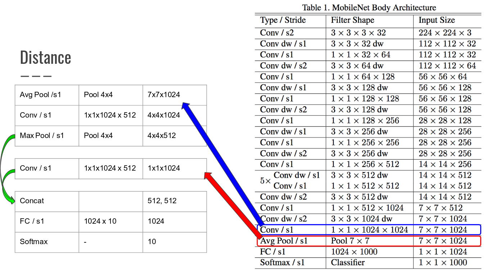

# Image Retraining

The initial contents of this folder are copied from [tensorflow examples](https://github.com/tensorflow/tensorflow/tree/master/tensorflow/examples/image_retraining).
To understand how it works, you can also see [tensorflow flowers tutorial](https://www.tensorflow.org/tutorials/image_retraining).

## Retraining
We use the `retrain.py` for training our model. This code, by default, downloads a pretrained model and trains a fully connected layer on it's outputs for classification.
We have modified that default behavior to be able to create a better model for our task. Please remember that there are also things to do after training this model. See the end of this document for these.
Briefly, the most important inputs of `retrain.py` are:

1. a folder containing  a set of sub-folders, each named after one of your categories and containing only images from that category.
2. name of the model that you want to train
3. the best configuration we have found so far is:

```
CUDA_VISIBLE_DEVICES=0 python retrain.py --image_dir=./data/ \
--architecture=mobilenet_1.0_224 --how_many_training_steps=200 \
--output_graph=./multiscale_1.0_224.pb --flip_left_right \
--random_brightness=40 --intermediate_store_frequency=100 \
--intermediate_output_graphs_dir=/vol/ccnlab-scratch1/erdi/intermediate_graphs_1.0/ \
--print_misclassified_test_images --summaries_dir=/vol/ccnlab-scratch1/erdi/retrain_logs/multiscale \
--output_labels=./labels --train_batch_size=64 --learning_rate=0.01
```

## The model
We use the mobilenet architecture with 224 x 224 inputs and 1.0 feature multiplier (i.e. mobilenet_1.0_224). This model trained on our dataset works well for objects that are less than ~30 cm's far from the device. To be able to increase this distance we make small modifications on this model.

### Modifications on the model:

Assume an object presence in a 2x2 area in this 7x7 input. When we sum the values inside this 2x2 area and divide it by 7x7, we end up losing a lot of information about this 2x2 area. To prevent that, we came up with the following solution.
Instead of just applying a global average pooling layer, we apply a 4x4 average pooling layer, followed by a fully connected layer and global max pooling layer.
We concatenate the output of this max pooling layer with the output of the fully connected layer after the global average pooling layer as shown in the image.
We apply a fully connected layer to this and apply softmax to get our results.



Implementation of this method is in the `retrain.py` under the function `add_final_training_ops`. Anything extending that idea or our model should be implemented in this function.

### Data Augmentation
We resize images in a random scale between `0.2` and `1 + (random_scale/100)`. To standardize the input size, we use resize_image_with_crop_or_pad.
One improvement here would be using a random crop operation instead of a crop operation. However, this would introduce a lot of complexity for fixing something that doesn't seem to cause a major issue.
Also, the augmentation configuration that we use is available in the best configuration above.

## I have trained a model, What's next?
After training this model, you need to make further changes to it.

### Labels
The labels generated by this program are stored on the file defined for the `output_labels` parameter.
This file contains a new line separated list of classes. The ordering of this list (starting from 0) is respective to the output tensor of this model.
For example, assume a labels file that look like:
```
key
chair
stone
```
The probability of class keys in the output tensor `output` would be available at index 0 and is available as `output[0]`, similarly, the probability of class chair is in `output[1]` and etc.

### Removing Background Classes
Another extra step that we take is to remove the background classes from the outputs, so that they are not included in the softmax operation.
We train our model with background classes so that it doesn't confuse the background with the objects and we remove those from the softmax outputs because we are not interested in the presence of the background, which is almost always present in real life and troublesome for our application.
The python script `remove_background_classes.py` contains the necessary logic for this operation. However, it needs to be modified as there are changes in the classes in our dataset.

The tensor `object_indices` represent the object indices that we want to keep in our model.

Assume that the labels file from the training look like:
```
keys
background_1
background_2
chair
stone
```
In this case we should remove background_1 and background_2 from our results so that they would not intervene with the object results.
To do so, we should provide `[0, 3, 4]` in the `object_indices` tensor and run this script.
Do not forget to change the input and output file names respectively.

Now that we have modified the object indices, the label indices have changed as well. The index in the `object_indices` tensor represent the new index of an object.
If we look at the previous example, the index of keys is now 0, the index of chair is now 1 because the previous index of this class is in the 1st index of this tensor. Similarly the new index for class stone would be 2.

We will use these indices in `class_tree.txt` under the assets folder of the android project.

## The Data
The data is stored in the file `data.tar.gz`. Extract the contents of that in this folder to train the model.
This dataset is curated from ImageNet dataset. The classes that we have are curated are combinations of synsets with id's:

* couch
  * n03077616
  * n03115762
  * n03115897
  * n03122202
  * n04256520
* floor
  * n04118021
  * n09282208
* key
  * n03561047
  * n03613294
  * n03896984
  * n04586581
* kitchen
  * n03619890
* kitchen-utensils
  * n03101986
  * n03619890
  * n03621049
* papers
  * n06255613
  * n14974264
* phone
  * n02992529
* remote
  * n04074963
* walking-stick
  * n04317420
  * n04546194
* wallet
  * n04548362

For more information about a synset, you can visit http://image-net.org/synset?wnid=n03077616 and replace the `wnid` parameter in the url with the synset id that you are interested in.

### Overcoming data imbalance
To overcome the imbalance in data, we found the class with maximum number of images and repeated other datasets to match that number. We did that by literally copy pasting the entire class in the same folder with another name.

